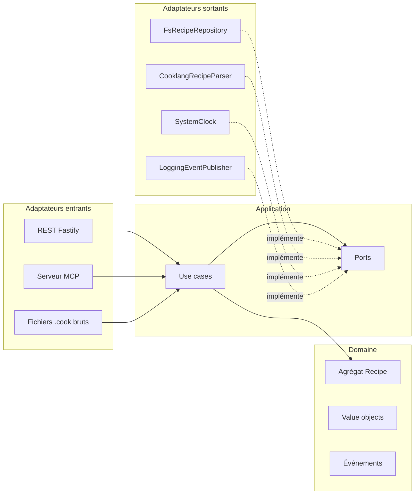

# Architecture

## Vue d'ensemble

Le serveur suit une **architecture hexagonale** (ports & adapters) avec un découpage
inspiré du **Domain-Driven Design**. Le sens des dépendances est strictement entrant :

## Couches

### `domain/` — le cœur métier

- **`Recipe`** : agrégat racine. Identifié par son slug, il possède sa source Cooklang et
  enregistre des événements de domaine (`recipe.created`, `recipe.updated`, `recipe.deleted`)
  récupérés par la couche application (`pullDomainEvents`).
- **Value objects** : `RecipeSlug` (identifiant sûr pour URL et système de fichiers, avec
  dérivation depuis un titre : « Bœuf Bourguignon » → `boeuf-bourguignon`) et
  `CooklangSource` (texte non vide, taille bornée).
- **Erreurs typées** : `RecipeNotFoundError`, `RecipeAlreadyExistsError`, etc., toutes
  dérivées de `DomainError` avec un `code` stable, mappé vers HTTP/MCP par les adaptateurs.

Règle vérifiée par dependency-cruiser : **cette couche n'importe rien** — ni npm,
ni node:*, ni les autres couches. Le temps lui est injecté en paramètre (`now: Date`).

### `application/` — l'orchestration

- **Use cases** (un fichier = une intention) : `ListRecipes`, `GetRecipe`, `SearchRecipes`,
  `CreateRecipe`, `UpdateRecipe`, `DeleteRecipe`. Ils orchestrent le domaine à travers les
  ports et publient les événements.
- **Ports** (interfaces) : `RecipeRepository`, `RecipeParser`, `Clock`,
  `DomainEventPublisher`.
- **DTOs** : la vue parsée d'une recette (`RecipeSummaryDto`, `RecipeDetailDto`) — la seule
  forme que les adaptateurs entrants connaissent.

Règle vérifiée : cette couche **n'importe jamais l'infrastructure ni aucun paquet npm**.

### `infrastructure/` — les adaptateurs

| Adaptateur                             | Port / rôle                      | Choix technique                                                                                             |
| -------------------------------------- | -------------------------------- | ----------------------------------------------------------------------------------------------------------- |
| `FsRecipeRepository`                   | `RecipeRepository`               | un fichier `<slug>.cook` par recette : portable (app mobile, git, rsync), écrit atomiquement (tmp + rename) |
| `CooklangRecipeParser`                 | `RecipeParser`                   | parseur officiel `@cooklang/cooklang` (cooklang-rs compilé en WASM), frontmatter YAML et métadonnées `>>`   |
| `recipe-routes` / `build-app`          | adaptateur entrant REST          | Fastify 5, erreurs domaine → statuts HTTP                                                                   |
| `mcp-routes` / `build-mcp-server`      | adaptateur entrant MCP           | SDK officiel, Streamable HTTP **sans état** (un couple serveur/transport par requête)                       |
| `WriteAccess`                          | garde d'écriture                 | comparaison en temps constant, _fail closed_ sans `WRITE_TOKEN`                                             |
| `oauth-routes` / `OAuthService`        | serveur d'autorisation OAuth 2.1 | RFC 8414/9728/7591, PKCE S256, jetons signés HMAC **sans état** (rien à persister) — protège `/mcp`         |
| `SystemClock`, `LoggingEventPublisher` | `Clock`, `DomainEventPublisher`  | trivial, remplaçables (bus, webhooks…)                                                                      |

### `main.ts` — composition root

Seul endroit où les adaptateurs sont instanciés et branchés sur les ports.

## Décisions notables

- **Stockage en fichiers plats** plutôt qu'une base : la collection reste un simple dossier
  de `.cook`, lisible par l'écosystème Cooklang (app mobile, CookCLI), versionnable, et le
  volume Railway suffit. Le port `RecipeRepository` permet de passer à SQLite/Postgres sans
  toucher au domaine ni aux use cases.
- **Lecture publique / écriture à jeton** : la garde est un souci d'adaptateur (HTTP header,
  argument MCP), pas du domaine — les use cases restent ignorants de l'authentification.
- **OAuth 2.1 sans état** : quand `OAUTH_SECRET` est défini, `/mcp` devient une ressource
  protégée pour les connecteurs distants (Claude Web). Codes, jetons et identifiants de client
  sont auto-portés par des jetons signés HMAC — aucun stockage, l'endpoint reste multi-instances
  et insensible à la veille. Reste optionnel : sans `OAUTH_SECRET`, `/mcp` est inchangé.
- **MCP sans état** : pas de session en mémoire, chaque requête est autonome ; l'endpoint
  supporte donc plusieurs instances et les redémarrages sans reconnexion des agents.
- **Événements de domaine** publiés vers les logs aujourd'hui ; le port
  `DomainEventPublisher` est le point d'extension (notifications, indexation, webhooks).

## Tests

| Niveau       | Où                                    | Ce qui est couvert                                                                    |
| ------------ | ------------------------------------- | ------------------------------------------------------------------------------------- |
| Unitaires    | `apps/server/test/unit`               | value objects, agrégat, use cases (repo en mémoire), parseur, garde d'écriture        |
| Intégration  | `apps/server/test/integration`        | API REST complète (fs réel, temp dir) et endpoint MCP avec le **client MCP officiel** |
| E2E          | `e2e/tests`                           | parcours web (Playwright), fichiers bruts, écritures authentifiées, MCP en JSON-RPC   |
| Architecture | `apps/server/.dependency-cruiser.cjs` | règles de dépendance entre couches, cycles, orphelins                                 |
